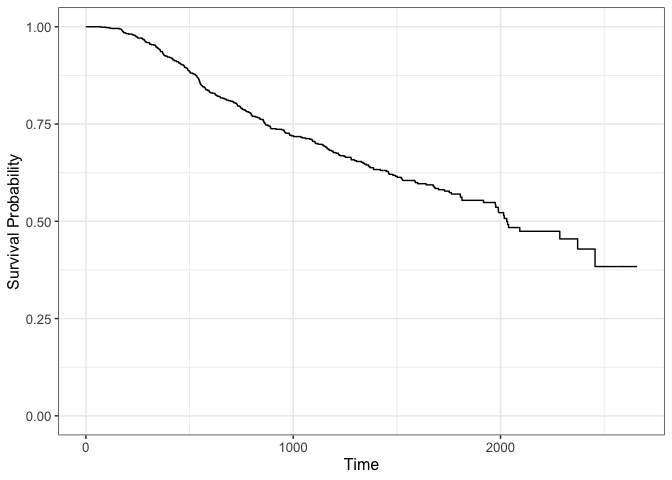

HW5
================
Camille Okonkwo
2024-02-26

### reading in data

``` r
hwdata1 = read_csv("data/hwdata1.csv")
```

    ## Rows: 686 Columns: 13
    ## ── Column specification ────────────────────────────────────────────────────────
    ## Delimiter: ","
    ## chr  (2): diagdate, recdate
    ## dbl (11): id, age, menopause, hormone, size, grade, nodes, prog_recp, estrg_...
    ## 
    ## ℹ Use `spec()` to retrieve the full column specification for this data.
    ## ℹ Specify the column types or set `show_col_types = FALSE` to quiet this message.

``` r
head(hwdata1)
```

    ## # A tibble: 6 × 13
    ##      id diagdate  recdate     age menopause hormone  size grade nodes prog_recp
    ##   <dbl> <chr>     <chr>     <dbl>     <dbl>   <dbl> <dbl> <dbl> <dbl>     <dbl>
    ## 1     1 17aug1984 15apr1988    38         1       1    18     3     5       141
    ## 2     2 25apr1985 15mar1989    52         1       1    20     1     1        78
    ## 3     3 11oct1984 12apr1988    47         1       1    30     2     1       422
    ## 4     4 29jun1984 24nov1984    40         1       1    24     1     3        25
    ## 5     5 03jul1984 09aug1989    64         2       2    19     2     1        19
    ## 6     6 24jul1984 08nov1989    49         2       2    56     1     3       356
    ## # ℹ 3 more variables: estrg_recp <dbl>, rectime <dbl>, censrec <dbl>

# 1a) Cox models

``` r
library(survival)
library(lmtest)
```

    ## Loading required package: zoo

    ## 
    ## Attaching package: 'zoo'

    ## The following objects are masked from 'package:base':
    ## 
    ##     as.Date, as.Date.numeric

``` r
hwdata1$hormone = factor(hwdata1$hormone, levels = c("2", "1"))
hwdata1$menopause = factor(hwdata1$menopause, levels=c("2", "1"))

model1 = coxph(Surv(rectime,censrec) ~ hormone,
            data = hwdata1,
            ties = "efron")

summary(model1)
```

    ## Call:
    ## coxph(formula = Surv(rectime, censrec) ~ hormone, data = hwdata1, 
    ##     ties = "efron")
    ## 
    ##   n= 686, number of events= 299 
    ## 
    ##           coef exp(coef) se(coef)     z Pr(>|z|)   
    ## hormone1 0.364     1.439    0.125 2.911   0.0036 **
    ## ---
    ## Signif. codes:  0 '***' 0.001 '**' 0.01 '*' 0.05 '.' 0.1 ' ' 1
    ## 
    ##          exp(coef) exp(-coef) lower .95 upper .95
    ## hormone1     1.439     0.6949     1.126     1.839
    ## 
    ## Concordance= 0.543  (se = 0.014 )
    ## Likelihood ratio test= 8.82  on 1 df,   p=0.003
    ## Wald test            = 8.47  on 1 df,   p=0.004
    ## Score (logrank) test = 8.57  on 1 df,   p=0.003

``` r
model2 = coxph(Surv(rectime, censrec) ~ hormone + age + menopause + size + nodes, 
               data = hwdata1,
               ties = "efron")
summary(model2)
```

    ## Call:
    ## coxph(formula = Surv(rectime, censrec) ~ hormone + age + menopause + 
    ##     size + nodes, data = hwdata1, ties = "efron")
    ## 
    ##   n= 686, number of events= 299 
    ## 
    ##                 coef exp(coef)  se(coef)      z Pr(>|z|)    
    ## hormone1    0.380887  1.463582  0.128253  2.970  0.00298 ** 
    ## age        -0.013537  0.986554  0.008990 -1.506  0.13213    
    ## menopause1 -0.353350  0.702332  0.178732 -1.977  0.04804 *  
    ## size        0.007841  1.007872  0.003895  2.013  0.04409 *  
    ## nodes       0.052096  1.053476  0.007328  7.109 1.17e-12 ***
    ## ---
    ## Signif. codes:  0 '***' 0.001 '**' 0.01 '*' 0.05 '.' 0.1 ' ' 1
    ## 
    ##            exp(coef) exp(-coef) lower .95 upper .95
    ## hormone1      1.4636     0.6833    1.1383     1.882
    ## age           0.9866     1.0136    0.9693     1.004
    ## menopause1    0.7023     1.4238    0.4948     0.997
    ## size          1.0079     0.9922    1.0002     1.016
    ## nodes         1.0535     0.9492    1.0385     1.069
    ## 
    ## Concordance= 0.664  (se = 0.016 )
    ## Likelihood ratio test= 65.9  on 5 df,   p=7e-13
    ## Wald test            = 91.5  on 5 df,   p=<2e-16
    ## Score (logrank) test = 94.21  on 5 df,   p=<2e-16

``` r
# LRT using class notes
-2*logLik(model2)
```

    ## 'log Lik.' 3510.31 (df=5)

``` r
-2*logLik(model1)
```

    ## 'log Lik.' 3567.388 (df=1)

``` r
# LRT using lmtest function
lrtest(model1, model2)
```

    ## Likelihood ratio test
    ## 
    ## Model 1: Surv(rectime, censrec) ~ hormone
    ## Model 2: Surv(rectime, censrec) ~ hormone + age + menopause + size + nodes
    ##   #Df  LogLik Df  Chisq Pr(>Chisq)    
    ## 1   1 -1783.7                         
    ## 2   5 -1755.2  4 57.078  1.192e-11 ***
    ## ---
    ## Signif. codes:  0 '***' 0.001 '**' 0.01 '*' 0.05 '.' 0.1 ' ' 1

# 1b) Cox models & Hand calculating HR + 95% CI

``` r
model3 = coxph(Surv(rectime, censrec) ~ hormone + age + menopause + size + nodes + hormone*nodes, 
               data = hwdata1,
               ties = "efron")

summary(model3)
```

    ## Call:
    ## coxph(formula = Surv(rectime, censrec) ~ hormone + age + menopause + 
    ##     size + nodes + hormone * nodes, data = hwdata1, ties = "efron")
    ## 
    ##   n= 686, number of events= 299 
    ## 
    ##                     coef exp(coef)  se(coef)      z Pr(>|z|)    
    ## hormone1        0.630191  1.877970  0.167339  3.766 0.000166 ***
    ## age            -0.015089  0.985024  0.009015 -1.674 0.094160 .  
    ## menopause1     -0.392802  0.675162  0.178948 -2.195 0.028159 *  
    ## size            0.006537  1.006558  0.003924  1.666 0.095694 .  
    ## nodes           0.082692  1.086208  0.013802  5.991 2.08e-09 ***
    ## hormone1:nodes -0.038185  0.962535  0.015395 -2.480 0.013123 *  
    ## ---
    ## Signif. codes:  0 '***' 0.001 '**' 0.01 '*' 0.05 '.' 0.1 ' ' 1
    ## 
    ##                exp(coef) exp(-coef) lower .95 upper .95
    ## hormone1          1.8780     0.5325    1.3528    2.6069
    ## age               0.9850     1.0152    0.9678    1.0026
    ## menopause1        0.6752     1.4811    0.4754    0.9588
    ## size              1.0066     0.9935    0.9988    1.0143
    ## nodes             1.0862     0.9206    1.0572    1.1160
    ## hormone1:nodes    0.9625     1.0389    0.9339    0.9920
    ## 
    ## Concordance= 0.663  (se = 0.016 )
    ## Likelihood ratio test= 71.59  on 6 df,   p=2e-13
    ## Wald test            = 92.24  on 6 df,   p=<2e-16
    ## Score (logrank) test = 96.08  on 6 df,   p=<2e-16

``` r
# extract information for hand calculating HR
model3$coefficients[c(1,6)] # beta_1 & beta_6
```

    ##       hormone1 hormone1:nodes 
    ##     0.63019149    -0.03818522

``` r
model3$var[1,1] # var(beta_1)
```

    ## [1] 0.0280023

``` r
model3$var[6,6] # var(beta_6)
```

    ## [1] 0.0002369987

``` r
model3$var[1,6] # cov(beta_1, beta_6)
```

    ## [1] -0.001652489

# Hazard ratio and 95% CI

``` r
library(rms)
```

    ## Loading required package: Hmisc

    ## 
    ## Attaching package: 'Hmisc'

    ## The following objects are masked from 'package:dplyr':
    ## 
    ##     src, summarize

    ## The following objects are masked from 'package:base':
    ## 
    ##     format.pval, units

    ## Warning in .recacheSubclasses(def@className, def, env): undefined subclass
    ## "ndiMatrix" of class "replValueSp"; definition not updated

    ## 
    ## Attaching package: 'rms'

    ## The following object is masked from 'package:lmtest':
    ## 
    ##     lrtest

``` r
dd = datadist(hwdata1)

options(datadist="dd")

ctr = contrast(cph(Surv(rectime, censrec) ~ hormone + age + menopause + size + nodes + hormone*nodes, 
               data = hwdata1,
               ties = "efron"),
               list(hormone = 1, nodes = 5),
               list(hormone = 2, nodes = 5))

print(ctr, fun=exp)
```

    ##   age menopause size nodes Contrast S.E.   Lower    Upper    Z Pr(>|z|)
    ## 1  53         2   25     5 1.441736   NA 1.08927 1.908253 2.56   0.0105
    ## 
    ## Confidence intervals are 0.95 individual intervals

# 1c) Survival curve and probability

``` r
library(ggsurvfit)

# curve for hormone = 1, age = 53, menopause = 1, size = 25, nodes = 3, based on model3
survfit2(model3, 
         newdata = data.frame(
           hormone = factor(1, levels = c("2", "1")),
           age = 53,
           menopause = factor(1, levels = c("2", "1")),
           size = 25, 
           nodes = 3)) |>
  ggsurvfit() +
  scale_y_continuous(limits=c(0,1))
```

<!-- -->

``` r
# output the survival table
model3.newdata = survfit(model3,
                       newdata = data.frame(
                         hormone = factor(1, levels = c("2", "1")),
                         age = 53,
                         menopause = factor(1, levels = c("2", "1")),
                         size = 25, 
                         nodes = 3))

# what is the probability that this patient survives more than three years (1095 days)?
surv_1095 = summary(model3.newdata, time = 1095)

prob_surv = 1 - surv_1095$surv
```
